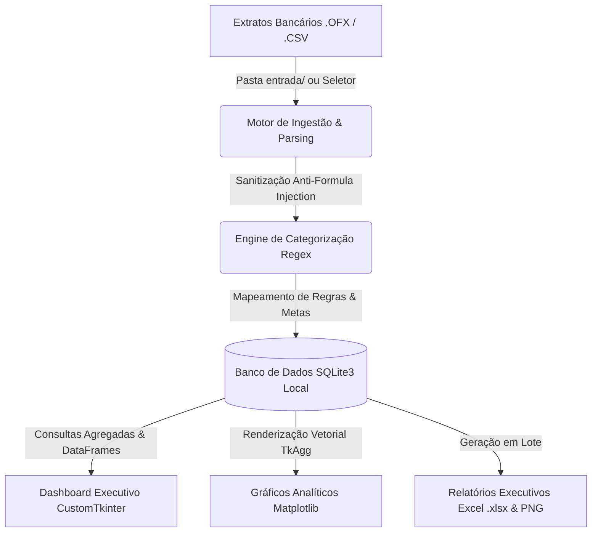

# 💎 FinanceAgent — Bank Reconciliation & Financial Intelligence Platform

<div align="center">


<p align="center">
  <b>Plataforma desktop de alta performance para conciliação contábil em lote, inteligência de gastos e auditoria financeira com total privacidade de dados (Local-First).</b>
</p>

</div>

---

## 📌 Visão Geral & O Problema de Negócio

A gestão financeira pessoal e de pequenos negócios frequentemente enfrenta três grandes gargalos:
1. **Fricção e Erro Humano:** Horas gastas na leitura manual de múltiplos extratos bancários (`.OFX` e `.CSV`) e digitação repetitiva de transações em planilhas.
2. **Riscos de Privacidade:** Serviços em nuvem expõem dados bancários sensíveis e padrões de consumo a terceiros e potenciais vazamentos de dados.
3. **Falta de Padronização:** Dificuldade em categorizar despesas e receitas automaticamente com regras de negócio customizáveis e gerar relatórios executivos confiáveis.

O **FinanceAgent** foi desenvolvido sob a ótica de engenharia de software para resolver esses problemas por meio de uma aplicação **Desktop Nativa, Local-First e Resiliente**, capaz de processar extratos bancários em lote, categorizar movimentações em milissegundos via Regex otimizado e persistir os dados em uma base relacional ACID com auditoria completa.

---

## 🏛️ Arquitetura do Sistema

O sistema adota uma arquitetura modular orientada a serviços locais, separando a camada de apresentação, motores de parsing/regras e persistência de dados.



### Principais Componentes:
- **Parser Nativo SGML/XML (`processar_conteudo_ofx`):** Processador tolerante a variações estruturais de arquivos OFX emitidos por diferentes instituições financeiras (Itaú, Bradesco, Nubank, Inter, Santander, etc.).
- **Engine de Classificação Heurística (`classificar_transacao`):** Categorização por expressões regulares ponderadas com atribuição de centros de custo e responsáveis.
- **Camada de Persistência SQLite3:** Transações com garantia ACID, controle de unicidade por identificador bancário (`FITID`) e consultas otimizadas via Pandas.
- **Camada de Apresentação Executive Dark:** Interface gráfica desktop desenvolvida com `CustomTkinter` baseada no padrão visual SaaS corporativo moderno.
- **Módulo de Exportação OpenPyXL:** Motor autônomo para geração de planilhas formatadas com fórmulas automáticas, paleta de cores corporativa e sumários executivos.

---

## ⚡ Diferenciais de Engenharia

| Diferencial | Descrição Técnica |
| :--- | :--- |
| **🛡️ Local-First & Zero Cloud** | Nenhum dado bancário é transmitido pela rede. Todas as operações de leitura, processamento e persistência ocorrem estritamente no armazenamento local do usuário. |
| **🔒 Sanitização Anti-Formula Injection** | Todas as descrições oriundas de extratos externos são tratadas para neutralizar vetores de ataque baseados em fórmulas maliciosas (`=`, `+`, `-`, `@`) antes da persistência ou exportação para Excel. |
| **🔄 Processamento Assíncrono Seguro** | Rotinas de importação em lote e renderização de relatórios operam com feedback visual reativo, preservando a responsividade da thread principal da interface gráfica. |
| **📂 Resiliência de Caminhos & Deploy** | Função `obter_diretorio_base()` com suporte transparente a caminhos com caracteres especiais, diretórios de nuvem sincronizada (ex: OneDrive) e executáveis empacotados (`sys.frozen` via PyInstaller). |
| **🎯 Controle de Duplicidade (Deduplicação)** | Detecção inteligente de lançamentos duplicados por `FITID` e assinatura de data/valor/descrição. |

---

## 🛠️ Stack Tecnológica

- **Linguagem Principal:** Python 3.11+
- **Interface Gráfica (GUI):** CustomTkinter (Executive Dark SaaS Theme)
- **Visualização de Dados:** Matplotlib (`TkAgg` backend integrado ao Tkinter)
- **Engine de Dados:** Pandas & SQLite3
- **Manipulação de Planilhas:** OpenPyXL (Styling, Formatação Numérica e Tabelas)
- **Empacotamento Desktop:** PyInstaller (Geração de binário standalone `.exe`)

---

## 📂 Estrutura do Repositório

```text
FinanceAgent/
├── entrada/                  # Pasta monitorada para extratos (.ofx e .csv)
│   ├── exemplo_extrato.ofx   # Mock data bancário realista para testes imediatos
│   ├── exemplo_extrato.csv   # Mock data tabular para testes de lote
│   └── .gitkeep
├── saida/                    # Diretório de destino de relatórios gerados (.xlsx, .png)
│   └── .gitkeep
├── app.py                    # Aplicação principal (GUI, navegação, views e workers)
├── theme.py                  # Design System & Tokens Visuais (Executive Dark SaaS)
├── process_extrato.py        # Motor de processamento, regras de regex e tetos
├── generate_excel.py         # Módulo de exportação de relatórios avançados em Excel
├── generate_charts.py        # Geração autônoma de gráficos estatísticos
├── iniciar.bat               # Script de auto-inicialização e gestão de venv
├── requirements.txt          # Dependências do ecossistema Python
├── FinanceAgent.spec         # Configuração de compilação PyInstaller
├── .gitignore                # Isolamento rigoroso de bancos e dados reais
└── README.md                 # Documentação técnica do projeto
```

---

## 🚀 Como Executar o Projeto

### Pré-requisitos
- **Python 3.10 ou superior** instalado no sistema ([python.org](https://www.python.org/downloads/)).
- Git instalado (opcional, para clonagem).

---

### Opção 1: Inicialização Automática (Windows)

O repositório inclui um script inteligente que cria automaticamente o ambiente virtual isolado, instala as dependências e executa o aplicativo:

1. Dê um duplo clique no arquivo `iniciar.bat` (ou execute `./iniciar.bat` no terminal).
2. O script cuidará do setup inicial e abrirá a interface desktop.

---

### Opção 2: Inicialização Manual via Terminal

1. **Clone o repositório:**
   ```bash
   git clone https://github.com/tslopes88/FinanceAgent_Git.git
   cd FinanceAgent_Git
   ```

2. **Crie e ative o ambiente virtual:**
   ```bash
   # Windows (PowerShell / CMD)
   python -m venv .venv
   .venv\Scripts\activate

   # Linux / macOS
   python3 -m venv .venv
   source .venv/bin/activate
   ```

3. **Instale as dependências:**
   ```bash
   pip install --upgrade pip
   pip install -r requirements.txt
   ```

4. **Execute a aplicação:**
   ```bash
   python app.py
   ```

---

## 🧪 Testando com os Dados de Demonstração (Mock Data)

O projeto já vem configurado com dados fictícios para demonstração imediata:

1. Inicie a aplicação (`python app.py` ou `iniciar.bat`).
2. Acesse a aba **"Conciliação OFX (Lote)"** na barra lateral.
3. Você verá os arquivos de exemplo `exemplo_extrato.ofx` e `exemplo_extrato.csv` detectados na pasta `entrada/`.
4. Selecione os titulares responsáveis e clique em **"Processar e Conciliar Lote"**.
5. Navegue até o **"Dashboard Executivo"** ou **"Extrato & Auditoria"** para visualizar os KPIs, gráficos de distribuição e transações categorizadas.
6. Clique em **"Exportar Relatório Excel"** para gerar a planilha analítica consolidada na pasta `saida/`.

---

## 📦 Gerando o Executável Standalone (.EXE)

Para compilar o aplicativo em um único executável desktop independente (sem necessidade de ter o Python instalado na máquina final):

```bash
# Com o ambiente virtual ativado:
pyinstaller FinanceAgent.spec
```

O executável compilado e seus recursos serão gerados no diretório `dist/FinanceAgent/`.

---

## 🔒 Segurança e Privacidade de Dados

Este repositório foi sanitizado para distribuição pública em conformidade com as melhores práticas de governança de código:
- O arquivo `.gitignore` bloqueia explicitamente bases de dados locais (`finanagent.db`, `*.sqlite3`), extratos reais e relatórios financeiros gerados.
- Todo o conjunto de dados presente no repositório (`exemplo_extrato.ofx` e `.csv`) é 100% sintético e gerado unicamente para fins de demonstração técnica e validação de arquitetura.

---

## 👨‍💻 Autor & Portfólio

Desenvolvido por **Thiago Lopes** — Engenharia de Software & Soluções Financeiras.

*Conecte-se para discussões sobre arquitetura de software, automação de processos e desenvolvimento desktop/web de alta performance.*
